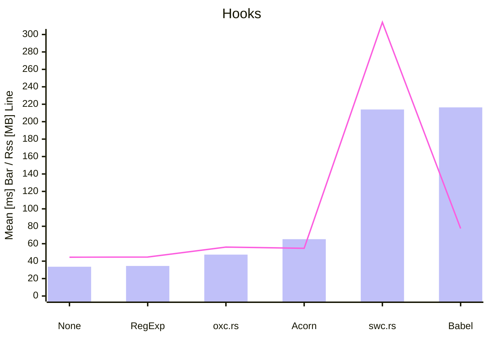

# `wrap-esm-lambda`


## Wrapping AWS Lambda ESM `handler`

The problem: How to transform AWS Lambda `handler` below?

```js
// input.js
export const handler = async(event) => {
    return "Hi from AWS Lambda";
};
```

To the following, notice the `WrapAwsLambda` wrapper:

```js
// transformed.js
export const handler = WrapAwsLambda(async(event) => {
    return "Hi from AWS Lambda";
});
```

Wrapping uses [async and sync loader hooks from Node.js](https://nodejs.org/api/module.html#customization-hooks).

This library uses [napi.rs](https://napi.rs/) and [oxc.rs](https://oxc.rs/).
For comparison the minimal wrapping code is re-implemented using [Babel](https://babeljs.io/), [Acorn](https://github.com/acornjs/acorn) and [swc.rs](https://swc.rs/).

## Usage

  1. Run `yarn install` to install dependencies.
  2. Run `yarn build` to build.
  3. Run `yarn test` to run Node binding tests with [`ava`](https://github.com/avajs/ava)
  4. Run `cargo fmt` and `cargo clippy` before committing
  5. Run `cargo test` to run Rust tests

### WebAssembly

  1. Run `rustup target add wasm32-wasip1-threads` to install build target
  2. Run `yarn build --target wasm32-wasip1-threads` to create `.wasm` file

### CI

CI tests against [`node@20`, `@node22`] x [`Linux`] matrix.

### Benchmarks

The benchmark table in [releases](https://github.com/filipkunc/wrap-esm-lambda/releases) is generated via
[`hyperfine`](https://github.com/sharkdp/hyperfine).

To run it locally use:

```sh
sudo apt update && sudo apt install -y hyperfine
cd hooks && ./bench_hooks.sh
```

Example output in `hooks/benchTable.md`:

| Command | Mean [ms] | Min [ms] | Max [ms] | Relative | Max RSS [MB] |
|:---|---:|---:|---:|---:|---:|
| `node runtime.mjs` | 33.6 ± 3.5 | 29.0 | 46.1 | 1.00 | 44.53 |
| `node --import ./sync-hooks-babel.mjs runtime.mjs` | 216.4 ± 27.5 | 174.4 | 279.3 | 6.44 ± 1.06 | 77.45 |
| `node --import ./sync-hooks-oxc.mjs runtime.mjs` | 47.5 ± 3.4 | 42.9 | 57.5 | 1.41 ± 0.18 | 56.09 |
| `node --import ./sync-hooks-oxc-wasm.mjs runtime.mjs` | 88.2 ± 6.1 | 79.5 | 104.8 | 2.63 ± 0.33 | 59.72 |
| `node --import ./sync-hooks-swc.mjs runtime.mjs` | 214.0 ± 25.1 | 162.8 | 253.0 | 6.37 ± 1.00 | 314.00 |
| `node --import ./sync-hooks-acorn.mjs runtime.mjs` | 65.2 ± 9.3 | 54.9 | 96.3 | 1.94 ± 0.34 | 54.76 |
| `node --import ./sync-hooks-regex.mjs runtime.mjs` | 34.5 ± 3.7 | 28.3 | 46.4 | 1.03 ± 0.15 | 44.69 |
| `node --import ./async-hooks-babel-one-file.mjs runtime.mjs` | 424.2 ± 17.7 | 399.4 | 455.2 | 12.63 ± 1.43 | 112.95 |
| `node --import ./register-async-hooks-babel.mjs runtime.mjs` | 269.4 ± 7.0 | 260.2 | 282.5 | 8.02 ± 0.87 | 88.05 |
| `node --import ./register-async-hooks-oxc.mjs runtime.mjs` | 100.2 ± 6.5 | 89.8 | 120.3 | 2.98 ± 0.37 | 68.13 |
| `node --import ./register-async-hooks-regex.mjs runtime.mjs` | 82.8 ± 6.7 | 71.0 | 101.5 | 2.46 ± 0.33 | 58.13 |


