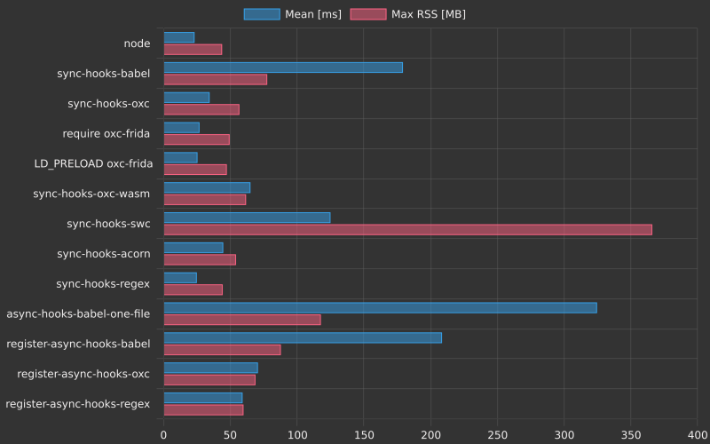

# `wrap-esm-lambda`


## Wrapping AWS Lambda ESM `handler`

The problem: How to transform AWS Lambda `handler` below?

```js
// input.js
export const handler = async(event) => {
    return "Hi from AWS Lambda";
};
```

To the following, notice the `WrapAwsLambda` wrapper:

```js
// transformed.js
export const handler = WrapAwsLambda(async(event) => {
    return "Hi from AWS Lambda";
});
```

Wrapping uses [async and sync loader hooks from Node.js](https://nodejs.org/api/module.html#customization-hooks).

This library uses [napi.rs](https://napi.rs/) and [oxc.rs](https://oxc.rs/).
For comparison the minimal wrapping code is re-implemented using [Babel](https://babeljs.io/), [Acorn](https://github.com/acornjs/acorn) and [swc.rs](https://swc.rs/).

## Usage

  1. Run `yarn install` to install dependencies.
  2. Run `yarn build` to build.
  3. Run `yarn test` to run Node binding tests with [`ava`](https://github.com/avajs/ava)
  4. Run `cargo fmt` and `cargo clippy` before committing
  5. Run `cargo test` to run Rust tests

### WebAssembly

  1. Run `rustup target add wasm32-wasip1-threads` to install build target
  2. Run `yarn build --target wasm32-wasip1-threads` to create `.wasm` file

### CI

CI tests against [`node@20`, `@node22`] x [`Linux`] matrix.

### Benchmarks

The benchmark table in [releases](https://github.com/filipkunc/wrap-esm-lambda/releases) is generated via
[`hyperfine`](https://github.com/sharkdp/hyperfine).

To run it locally use:

```sh
sudo apt update && sudo apt install -y hyperfine
cd hooks && ./bench_hooks.sh
```

Example output is in [hooks/benchTable.md](hooks/benchTable.md):



### Frida hooking

The https://frida.re/ is used for hooking into `open`, `read` and `uv_fs_stat` against Node v22.18.0.  
Problematic function is `uv_fs_fstat` which does not have stable definition of `libuv_sys2::uv_fs_t` struct!
