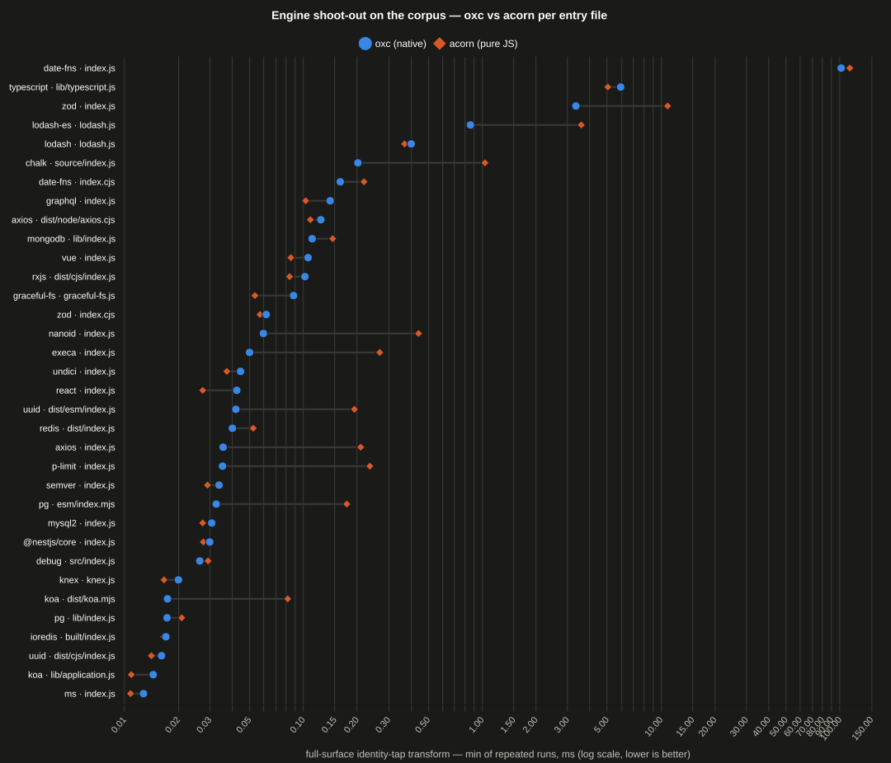

# Engine benchmark on the corpus

_Generated by `node corpus/bench.mts` — do not edit. Minimum of repeated full-surface identity-tap transforms (the real `applyMatched` pipeline, star walk included) per corpus entry file; one process per engine._

Node v24.18.0 · Intel(R) Xeon(R) Processor @ 2.80GHz · oxc = native release addon, acorn = pure JS (@wrap-esm-lambda/engine-acorn)

## ESM entries — the engine comparison

Only in ESM mode do the engines do engine work: parse, validate every requested binding against the statically visible exports, and on the rewrite tier regenerate the module. This is where oxc and acorn genuinely differ.

| package | entry | tier | bindings | source KB | oxc ms (min) | acorn ms (min) | acorn/oxc | output |
| --- | --- | --- | --- | --- | --- | --- | --- | --- |
| pg | esm/index.mjs | rewrite | 12 | 0.6 | 0.03 | 0.28 | 8.8× | engine-styled |
| zod | index.js | rewrite | 109 | 0.1 | 2.46 | 10.0 | 4.1× | code = / maps ≠ |
| axios | index.js | rewrite | 18 | 0.7 | 0.04 | 0.20 | 5.7× | engine-styled |
| date-fns | index.js | append | 250 | 8.7 | 7.54 | 19.1 | 2.5× | identical |
| uuid | dist/esm/index.js | rewrite | 14 | 0.6 | 0.04 | 0.17 | 4.1× | code = / maps ≠ |
| nanoid | index.js | rewrite | 5 | 1.9 | 0.06 | 0.46 | 7.7× | engine-styled |
| lodash-es | lodash.js | rewrite | 322 | 16.8 | 0.89 | 3.58 | 4.0× | engine-styled |
| chalk | source/index.js | rewrite | 13 | 5.8 | 0.17 | 0.99 | 5.8× | engine-styled |
| execa | index.js | rewrite | 13 | 1.0 | 0.04 | 0.27 | 6.6× | engine-styled |
| p-limit | index.js | append | 2 | 2.5 | 0.03 | 0.20 | 5.8× | identical |
| koa | dist/koa.mjs | rewrite | 2 | 0.1 | 0.02 | 0.08 | 4.7× | engine-styled |
| **total** | 11 entries | | | | **11.3** | **35.4** | **3.1×** | |

ESM acorn/oxc: **3.1× summed**, geometric mean **5.2×** per entry. Rewrite-tier output is engine-styled by construction — oxc regenerates through codegen (normalized formatting), acorn edits via magic-string (original formatting preserved) — and source maps differ likewise (per-statement vs per-token); 7 rewrite entries are engine-styled here. Semantic parity of the rewrite is asserted by run.mts's identity cells, which pass under either engine.

## CJS entries — plumbing sanity, not an engine race

In CJS mode the tap IGNORES the input by design: no parse, no validation — accessors over `module.exports` are appended sight-unseen (delivered through the same registerHooks source pipeline that serves ESM; `Module._load` is never touched). Both engines therefore share the byte pipeline and should tie; a gap in this table would be a plumbing bug, not an engine result.

| package | entry | tier | bindings | source KB | oxc ms (min) | acorn ms (min) | acorn/oxc | output |
| --- | --- | --- | --- | --- | --- | --- | --- | --- |
| lodash | lodash.js | append | 308 | 533 | 0.41 | 0.41 | 1.0× | identical |
| debug | src/index.js | append | 21 | 0.3 | 0.03 | 0.03 | 0.9× | identical |
| ms | index.js | append | 1 | 3.0 | 0.01 | 0.01 | 0.9× | identical |
| semver | index.js | append | 46 | 2.6 | 0.03 | 0.03 | 0.8× | identical |
| pg | lib/index.js | append | 13 | 1.8 | 0.02 | 0.03 | 1.8× | identical |
| react | index.js | append | 44 | 0.2 | 0.04 | 0.03 | 0.7× | identical |
| graceful-fs | graceful-fs.js | append | 105 | 12.4 | 0.06 | 0.05 | 0.8× | identical |
| ioredis | built/index.js | append | 12 | 2.5 | 0.02 | 0.02 | 0.9× | identical |
| mongodb | lib/index.js | append | 136 | 25.3 | 0.11 | 0.13 | 1.2× | identical |
| typescript | lib/typescript.js | append | 2244 | 8854 | 6.19 | 5.28 | 0.9× | identical |
| zod | index.cjs | append | 109 | 1.4 | 0.06 | 0.06 | 0.9× | identical |
| axios | dist/node/axios.cjs | append | 35 | 211 | 0.12 | 0.11 | 0.9× | identical |
| date-fns | index.cjs | append | 250 | 83.0 | 0.15 | 0.14 | 0.9× | identical |
| vue | index.js | append | 171 | 0.2 | 0.11 | 0.10 | 0.9× | identical |
| uuid | dist/cjs/index.js | append | 14 | 2.3 | 0.02 | 0.01 | 0.9× | identical |
| graphql | index.js | append | 215 | 30.0 | 0.14 | 0.10 | 0.7× | identical |
| rxjs | dist/cjs/index.js | append | 173 | 34.3 | 0.10 | 0.15 | 1.5× | identical |
| undici | index.js | append | 57 | 8.2 | 0.05 | 0.04 | 0.8× | identical |
| mysql2 | index.js | append | 24 | 2.0 | 0.03 | 0.03 | 0.8× | identical |
| redis | dist/index.js | append | 47 | 2.6 | 0.04 | 0.03 | 0.8× | identical |
| koa | lib/application.js | append | 1 | 8.8 | 0.02 | 0.01 | 0.7× | identical |
| knex | knex.js | append | 10 | 0.6 | 0.02 | 0.02 | 0.8× | identical |
| @nestjs/core | index.js | append | 31 | 1.8 | 0.04 | 0.03 | 0.7× | identical |
| **total** | 23 entries | | | | **7.81** | **6.83** | **0.9×** | |

CJS acorn/oxc: geometric mean **0.9×** per entry — the expected tie. Append-tier byte-parity (asserted across BOTH tables): holds on every append entry.
