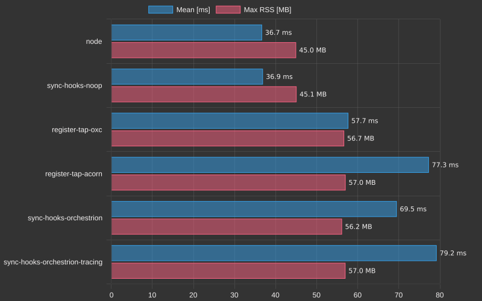
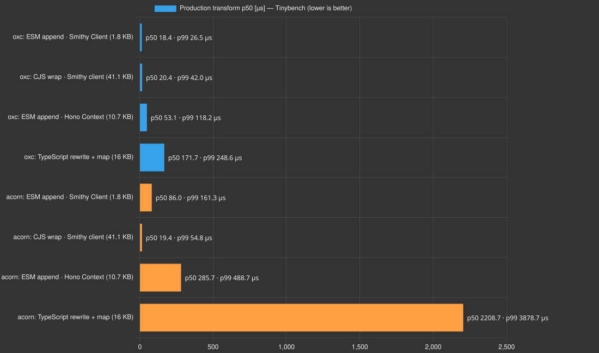

# Benchmarks

Cold start is the primary performance measure. A transformed module normally
runs through the hook once, so repeated in-process transforms are diagnostics,
not the user-visible headline.

## Cold start

[`benchmarks/hooks/bench_hooks.sh`](../benchmarks/hooks/bench_hooks.sh) uses
[`hyperfine`](https://github.com/sharkdp/hyperfine) to launch a fresh Node
process for every sample. It compares the baseline, a no-op synchronous hook,
the production runtime tap under OXC and Acorn, plus hand-written probes of
neighboring mechanisms. Every row is a complete process, but the adapters are
not equivalent products: the Wrap rows load its production registration and
config path, while the Orchestrion rows use a small benchmark-local hook.
Those neighboring rows are exploratory and are not a sound basis for a
cross-project headline.

```sh
sudo apt update && sudo apt install -y hyperfine
cd benchmarks/hooks && ./bench_hooks.sh
```

The committed result is [benchmarks/hooks/benchTable.md](../benchmarks/hooks/benchTable.md):



On pull requests, CI builds base and head side by side and interleaves their
commands in one Hyperfine invocation. This avoids comparing numbers from
different shared runners. The table is published in the workflow summary.

## Engine transform diagnostics

`pnpm bench` also runs a focused OXC-versus-Acorn diagnostic suite using
[Tinybench](https://github.com/tinylibs/tinybench). Every case calls core's
production `applyMatched()` entry point—the same function used by the runtime
hook and build plugins—with loader-style `Buffer` inputs. Each engine runs in
its own process and is verified after binding, preventing native fallback from
making both columns measure Acorn.

The cases cover:

- ESM append-only validation on the real `@smithy/core` client module;
- the complete CJS evaluation wrapper on its real compiled client;
- Hono's larger `Context` module on the append path;
- TypeScript lowering, binding rewrite, code generation, and upstream-map
  chaining.

Tinybench reports p50, p99, relative margin of error, and sample count. The
chart uses p50 bars and prints p99 beside them:



```sh
pnpm bench        # transform distributions
pnpm bench:chart  # regenerate the engine chart
```

These measurements answer where engine time goes; they do not pretend that a
parser call equals a complete instrumentation mechanism. Low-level
`exportsTap()` or parser profiling belongs in temporary `perf`/flamegraph
investigations when a production case behaves unexpectedly.

## Equivalent Orchestrion transform diagnostic

`pnpm bench:compare` measures the overlapping transform task described in
[the Orchestrion comparison](comparisons.md#performance-comparison). Both tools
receive the same string containing the real `@smithy/core` ESM client, with a
preselected matcher and one request to make `Client#send` interceptable. Each
tool runs under identical Tinybench settings in its own child process.

The command prints the exact package versions, Node version, platform, CPU,
p50, p95, p99, relative margin of error and sample count. Its launch order is
randomized to avoid always favoring the first process:

```sh
pnpm bench:compare
```

The behavioral test executes a smaller transformed fixture and proves that
both mechanisms change the same resolved value. The benchmark worker also
rejects unchanged or structurally invalid output before collecting samples.

These numbers cover transform time only. They exclude matcher construction,
config loading, hook registration, module compilation and evaluation, patch
or subscriber execution, and invocation overhead. Publish them only with this
scope and the emitted environment metadata; do not turn their ratio into a
whole-product claim.

## Real npm packages

The wider engine comparison is [`tests/corpus/bench.mts`](../tests/corpus/bench.mts). It
runs `applyMatched()` over the statically visible export surfaces of the pinned
npm corpus, including star graphs and filesystem reads. The companion
behavioral corpus executes the transformed packages under both engines, so a
fast result cannot hide broken output. See the [corpus README](../tests/corpus/README.md).

Transform diagnostics intentionally exclude config loading, package matching,
Node compilation, and patch execution. Hyperfine cold starts include those
costs and remain the regression metric for this project's production path.
Cross-project cold-start claims additionally require equivalent production
adapters and verified behavior.
