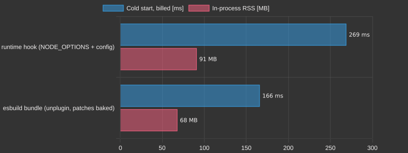

# `example-hono-lambda`

A [Hono](https://hono.dev/) app on AWS Lambda, instrumented from one config
with **zero app changes** — the practical composition of everything the
toolkit does, on the platform this repo was born on:

| layer               | entry                                                                                                                                                             | what the logs gain                                                                          |
| ------------------- | ----------------------------------------------------------------------------------------------------------------------------------------------------------------- | ------------------------------------------------------------------------------------------- |
| the handler itself  | [`aws-lambda` preset](../../packages/hooks/src/aws-lambda.mts) — nothing about the handler is written down; `_HANDLER` and `LAMBDA_TASK_ROOT` are read at preload | `invocation = 5.9 ms, rss = 93 MB` — wall time and RSS from inside the process              |
| the framework       | `hono`'s ESM defining module, `Hono` rebound to a subclass that injects a first middleware                                                                        | `http.route = GET /quotes/:id -> 200` — the matched route **template**, OTel's `http.route` |
| the AWS SDK beneath | `@smithy/core`'s client submodule — every `@aws-sdk/client-*` operation funnels through one `Client#send`                                                         | `aws.operation = PutObjectCommand` — and the call never reaches credentials or the network  |

[`app.mjs`](app.mjs) is written exactly the way production code is written:
`export const handler = handle(app)` from `hono/aws-lambda`, an `S3Client`
configured by the execution environment, no imports from this toolkit. The
three patches live in [`patches/`](patches), the config in
[`wrap.config.mjs`](wrap.config.mjs), and activation is the usual runtime
flag, which Lambda accepts through `NODE_OPTIONS`.

## Run it

Locally, through the RIC's exact load sequence
([`invoke-local.mjs`](invoke-local.mjs)) answering the two API Gateway v2
events under [`events/`](events):

```sh
pnpm --filter example-hono-lambda start
```

```
http.route = GET /quotes/:id -> 200
invocation = 5.9 ms, rss = 93 MB
GET /quotes/42 -> 200 {"id":"42","quote":"Simplicity is prerequisite for reliability."}
aws.operation = PutObjectCommand
http.route = POST /quotes -> 201
invocation = 1.6 ms, rss = 93 MB
POST /quotes -> 201 {"stored":"7"}
```

On the platform's own runtime image — AWS's real runtime interface client
booted by the image's own entrypoint, driven over HTTP through the runtime
interface emulator the base images ship:

```sh
.github/scripts/hono-lambda-rie.sh public.ecr.aws/lambda/nodejs:22 linux/amd64
```

The CI Lambda lane runs exactly that on every push (both architectures, both
runtimes) and reads the platform's own accounting back off the container
logs onto the job summary:

```
REPORT RequestId: …  Duration: 417.64 ms  Billed Duration: 418 ms  Memory Size: 512 MB  Max Memory Used: 512 MB
REPORT RequestId: …  Duration: 5.66 ms    Billed Duration: 6 ms    Memory Size: 512 MB  Max Memory Used: 512 MB
container cgroup peak: 121 MB
```

The REPORT duration and billed milliseconds are the emulator's real
measurements (note the cold start on the first line). Its `Max Memory
Used`, despite appearances, is an echo of the configured size: vary
`AWS_LAMBDA_FUNCTION_MEMORY_SIZE` and the field tracks it exactly, whatever
the process actually used — the emulator meters time, not memory (on an
actual Lambda the same field is a genuine measurement). So the script reads
the genuine local number from the container's own cgroup (`memory.peak`, or
`memory.max_usage_in_bytes` on a v1 hierarchy) and reports it alongside —
the container-level max next to the patch's in-process `rss`.

## SQS in, SNS out — the same config

The example's second handler, [`consumer.mjs`](consumer.mjs), is the other
Lambda shape: an SQS batch in, an SNS `PublishCommand` per record out, and
the partial-batch contract back to the platform (`batchItemFailures` names
the records to redrive — the fixture's deliberately malformed third record
exercises it). Nothing in `wrap.config.mjs` changes: `_HANDLER` now says
`consumer.handler`, so the aws-lambda preset derives its entry for this
file instead, and the smithy entry sees SNS the way it saw S3 — every
`@aws-sdk/client-*` operation funnels through the same `Client#send`.

```sh
pnpm --filter example-hono-lambda start:consumer
```

```
aws.operation = PublishCommand
aws.operation = PublishCommand
invocation = 0.8 ms, rss = 79 MB
SQS batch of 3 -> {"batchItemFailures":[{"itemIdentifier":"broken-3"}]}
```

The CI Lambda lane boots this handler in a second container (one container
boots one handler) and drives the same SQS event through the real RIC.

## The contrast: the same patches at build time, and what that buys

Everything above delivers the instrumentation at runtime — the hook rides
`NODE_OPTIONS`, the config is read at preload, an engine transforms modules
as they load. [`build.mjs`](build.mjs) delivers the SAME patches the other
way: esbuild bundles each handler with the
[unplugin](../../packages/unplugin) adapter and
[`wrap.config.build.mjs`](wrap.config.build.mjs) — the runtime config's
package entries reused verbatim, plus the handler entries written down
explicitly, because on a build machine there is no `_HANDLER` to discover
them from. The result under `dist/` is just JavaScript: no hook, no config,
no engine in the process.

```sh
pnpm --filter example-hono-lambda build
pnpm --filter example-hono-lambda start:built            # same output, plain node
pnpm --filter example-hono-lambda start:built:consumer
```

The CI Lambda lane boots `dist/` in a third container with nothing but
`LAMBDA_TASK_ROOT` set, asserts the same instrumentation lines appear (the
bundle carries the patches itself), and puts the two deliveries' cold
starts side by side on the job summary:

```
Cold start, billed: runtime hook 269 ms vs esbuild bundle 166 ms
```



The committed numbers behind the chart live in
[`coldStartTable.md`](coldStartTable.md) (median of five emulator boots per
delivery, provenance included; `node make-chart.mjs` regenerates the SVG
after re-measuring — the job summary carries the live per-image numbers).
The difference — billed by the platform's own REPORT line on the platform's
own image — is what runtime delivery costs: the preload, the config
evaluation, the engine binding and the on-load transforms, none of which
exist in the bundle. The trade is the usual one: build-time delivery is
zero-cost at runtime but fixed at build time; runtime delivery patches
whatever the deployed function actually loads, with no build step at all.

## Why there is no LocalStack here

The `POST /quotes` route really calls `S3Client#send` on the real AWS SDK.
The patch intercepts at the one place every SDK operation passes through —
`Client#send` in `@smithy/core` — **before** the middleware stack builds, so
no credentials are resolved and nothing reaches the wire. The same
interception point that instruments the SDK is the one that makes an AWS
stand-in unnecessary for testing: the assertion moves from "what arrived at
a fake S3" to "what the app asked the SDK to do", with no emulator to
license, start, or keep compatible. A forwarding APM patch would keep the
original `send` and time around `original.call(this, command, ...rest)`
instead of returning a stub — the interception point is the same.

[`__test__/hono-lambda.spec.ts`](../../__test__/hono-lambda.spec.ts) drives
this example on every CI lane; the Lambda lane additionally runs it through
the real RIC as above.
